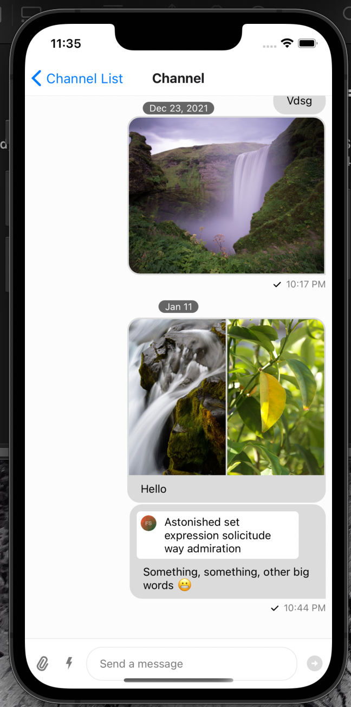

<h1 align="center">Stream Chat React Native - Quoted message avatars</h1>

This is an example app that shows the avatar of the user being quoted in a reply:




## Implementation

To add these changes, the following has been added on the [Channel screen](./screens/ChannelScreen.tsx):

```tsx
const ReplyOriginalAuthorAvatar = ({message}: {message: LocalMessageType}) => {
  if (
    message === undefined ||
    message.quoted_message?.user?.image === undefined
  ) {
    return null;
  }
  const imageUri = message.quoted_message?.user?.image;

  if (imageUri === undefined) {
    return null;
  }

  const imageSize = 20;
  const imageStyles = {
    borderRadius: imageSize / 2,
    width: imageSize,
    height: imageSize,
  };

  return (
    <Image
      style={imageStyles}
      source={{
        uri: imageUri,
      }}
    />
  );
};

const CustomReply = () => {
  const {message} = useMessageContext();
  if (message === undefined || message.quoted_message === undefined) {
    return <Reply />;
  }
  const quotedMessage = message.quoted_message;

  const truncatedMessage = quotedMessage.text?.substring(
    0,
    Math.max(50, quotedMessage.text.length),
  );
```

`CustomReply` was added to the prop `Reply` on `Channel`.

## Running the app

This uses `yarn`, but you can use `npm` or `pnpm` as well if you prefer.

1. Install the needed packages from the npm registry
```
yarn install
```

2. (IOS) Install pod from cocoapods:
```
npx pod install
```
OR
```
(cd ios; pod install)
```

3. Run the app and the Metro bundler:

```
yarn ios
```
OR
```
yarn android
```


